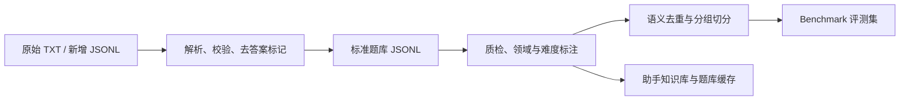
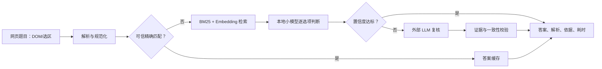

# CyberWikiBench 与 Chrome 做题助手设计方案

## 目标与边界

项目分为两个独立系统，共用题库 schema、检索模块和日志格式：

- **CyberWikiBench**：衡量模型的网络安全知识答题能力，重点是可复现、无泄漏的准确率与延迟。
- **Cyber Quiz Assistant**：用于授权的练习和自测，可使用题库匹配、RAG、本地模型和外部 LLM 来提高实际答题体验。

两者不能共享隐藏测试题的问答内容。助手的命中率不应被当作闭卷模型能力。

## 现有题库结论

当前题库含 931 题：776 道四选一题和 155 道判断题，来源为 5 份网管四级练习题。选择题答案位置较均衡，适合作为基准的初始题源。

源文件需要经过结构化清洗：输入侧移除 `← 正确答案` 标记；以 `[编号] [来源]` 而不是横线拆题，以保留命令输出和表格；对疑似 OCR/转录错误、版本依赖和争议题进行人工复核。

## 数据管线

标准格式与新增流程见 [题库数据标准](题库数据标准.md)。

## Benchmark 设计

### 数据集切分

在质检并剔除 `rejected` 题后，按语义相似题簇进行分组、再按领域/题型/难度分层切分：

| 分区 | 比例 | 用途 |
| --- | ---: | --- |
| `dev` | 20% | 公开答案与解析；仅用于开发提示词、阈值和配置。 |
| `public_test` | 30% | 公开题目，答案由评测服务保存。 |
| `private_test` | 50% | 题目和答案都不公开，作为正式成绩。 |

不建议把现有 931 题的一部分用于微调后再作为同源测试；如需训练集，应引入独立来源。后续增加 100～200 道参数变换、选项置换、场景化和对抗混淆题，构成挑战集，降低模型背题带来的虚高分数。

### 评测赛道

1. **闭卷知识赛道**：模型只看到题目和选项。主榜使用此成绩。
2. **固定资料开卷赛道**：所有系统使用同一版本证据库，评价检索与基于证据推理。
3. **完整助手赛道**：允许缓存、RAG、本地与远程模型路由，评价真实产品效果。

### 指标与协议

- 主要指标：Overall Accuracy、领域/题型/难度的 Macro Accuracy。
- 速度：端到端 p50、p95；分别报告冷启动和热启动。
- 联合指标：`Accuracy@1s`、`Accuracy@3s`、`Accuracy@10s`，只有在时限内答对才得分。
- 可靠性：置信度校准（ECE、Brier）、允许拒答时的覆盖率/准确率曲线。
- 稳健性：选项重排、题干轻度改写、重复执行的一致率。
- 成本：每千题成本、输入/输出 token 和检索耗时。

选择题以标准答案精确判分，不能用 LLM 裁判取代主评分。每轮评测记录模型版本、提示词版本、知识库版本、检索片段、随机种子和原始输出，并报告 95% bootstrap 置信区间。

## Chrome 助手架构

扩展采用 Manifest V3：Content Script 提取当前题目，Service Worker 负责编排，Side Panel 展示结果。Chrome 的 Manifest V3 使用按需运行的 Service Worker，原生支持 Side Panel；扩展包不能加载远程可执行代码。[Chrome Manifest V3](https://developer.chrome.com/docs/extensions/develop/migrate/what-is-mv3) [Manifest](https://developer.chrome.com/docs/extensions/reference/manifest)

推荐分层：

- **扩展端**：DOM 提取、规范化、侧边栏 UI、短期缓存、用户设置。
- **本地 Companion**：Embedding、BM25、重排、本地量化小模型、索引维护。
- **远程 Gateway**：统一适配外部 LLM，保管密钥、做限流和审计。

原型可以通过 localhost 调用本地服务；发布桌面版可用 Native Messaging 与本地 Companion 建立受限通信。本地通信只能由扩展页或 Service Worker 发起，Content Script 通过消息转发。[Chrome Native Messaging](https://developer.chrome.com/docs/extensions/develop/concepts/native-messaging)

## 准确率与速度策略

1. 题干和选项完全命中可信题库时快速返回。
2. 未命中时并行执行关键词检索和向量检索，用融合排序取候选证据。
3. 本地小模型逐个评估选项，输出结构化答案和置信度，而非长篇自由生成。
4. 检索弱、置信度低、模型与证据冲突、或题目含复杂配置表时，升级到外部 LLM。
5. 复核仍无足够依据时明确标注低置信度，不伪造确定答案。

在 `dev` 集校准阈值。高置信“本地直出”路径要以目标精度设阈值，例如达到 97% 后才允许绕过外部模型。

可提供四种模式：极速（本地/缓存优先）、均衡（低置信升级）、严谨（本地和远程并行复核）、隐私（完全本地）。

## RAG 规范

- 题库以结构化记录存储；教材、标准、设备文档和审核解析另建知识库。
- 普通知识按约 300～600 中文字切片；命令、配置和表格作为完整片段保存。
- 用 BM25 与向量检索混合召回，再进行轻量重排。
- 每次回答记录知识库版本、检索片段、分数和模型调用链。
- 隐藏测试题及答案不得进入精确匹配缓存、向量库或远程提示词。

## 安全与产品边界

- 默认只在用户点击扩展、快捷键或菜单操作后读取当前标签页，优先使用 `activeTab`，避免默认请求全站读取权限。[Chrome activeTab](https://developer.chrome.com/docs/extensions/develop/concepts/activeTab)
- 只传输提取出的题干和选项，不上传页面 HTML、Cookie、账号信息或浏览历史。
- Content Script 传来的内容视为不可信，Service Worker 校验消息格式并进行 HTML 转义。[Chrome 消息安全](https://developer.chrome.com/docs/extensions/develop/concepts/messaging)
- 默认只给出建议答案，不自动点击或提交；产品定位为授权练习和自测。

## 实施顺序

1. 用解析器生成标准 JSONL、聚合 JSON 和质检报告；补齐题目审核状态。
2. 完成命令行 benchmark runner，建立闭卷基线和错误分析报告。
3. 加入知识库、混合检索、本地/远程模型路由与日志。
4. 接入 Chrome Side Panel，先支持 DOM 提取与手动选区，再考虑 OCR。
5. 增加挑战集、选项置换和线上隐藏评测。

## 当前 MVP 实现

当前仓库已经落地本地 MVP：

- `benchmark/server.py` 提供本地 Web 服务和版本化 API。
- `benchmark/service.py` 负责按题型、来源、领域、数量和随机种子抽题，并使用 SQLite 持久化测试集与评分结果。
- `web/` 提供人工答题、自动评分和逐题错误分析界面。
- `scripts/run_model_benchmark.py` 可在 CLI 中并行调用 OpenAI-compatible 模型接口，并自动提交答案和生成报告。
- 完整 API 契约见 [API 文档](API.md)。
